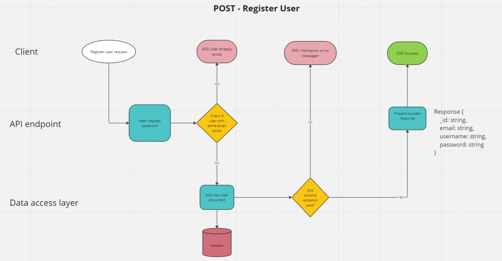

## User Authentication

### User Story - 1
As a new user, I want to register for an account on the web application so that I can access its features.

### User Story - 2
As a registered user, I want to log in to the web application using my credentials to access my account.

### User Story - 3
As a registered user, I want to change my password through the application to enhance security.

### User Story - 4
As the system I need to confirm the authorization of users via the token included in each request. This allows me to maintain control over access for authenticated users, ensuring the protection of user data and accounts.

## Favourite Locations 

### User Story - 5
As an authenticated user, I want to get my stored favourite locations from the web application to review and manage them effectively.

### User Story - 6
As an authenticated user, I want to be able to add a new location in my favourite list via the web application, simplifying access to its weather forecast details in the future.

### User Story - 7
As an authenticated user, I want to be able to remove a location from my favourites using the web application to maintain an updated list.

### User Story - 8
As the system, I need to verify the authorization of users via the token included in each request when managing favourite locations, to ensure that only authenticated users can access and modify their own favourite locations data .

## Routing diagrams

Figure 1: Routing Diagram - register user

Figure 2: Routing Diagram - login user

Figure 3: Routing Diagram - change password

Figure 4: Routing Diagram - favourite locations

Figure 5: Routing Diagram - get favourite locations