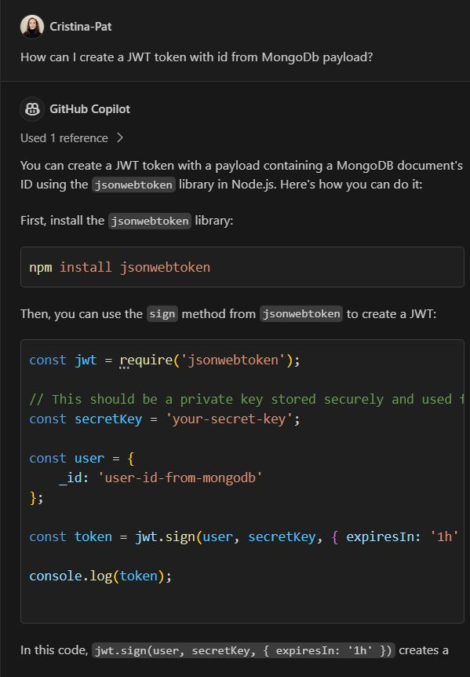
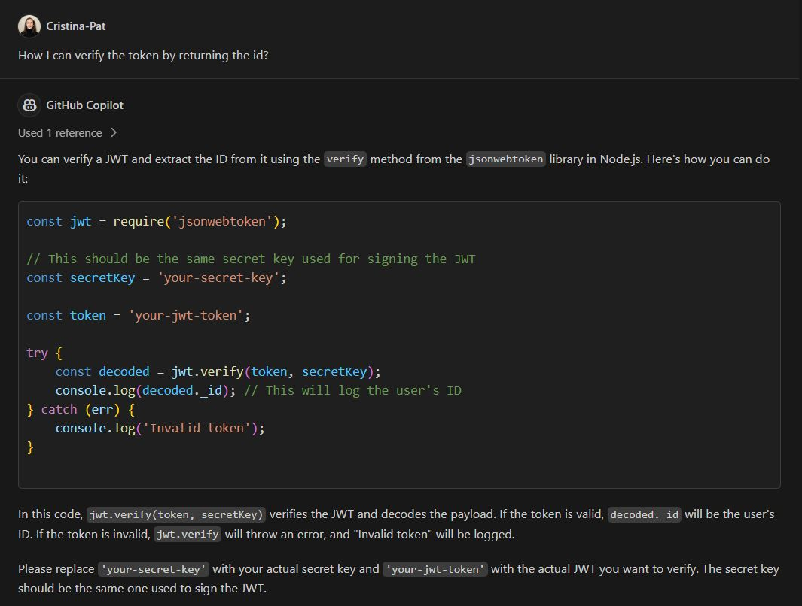
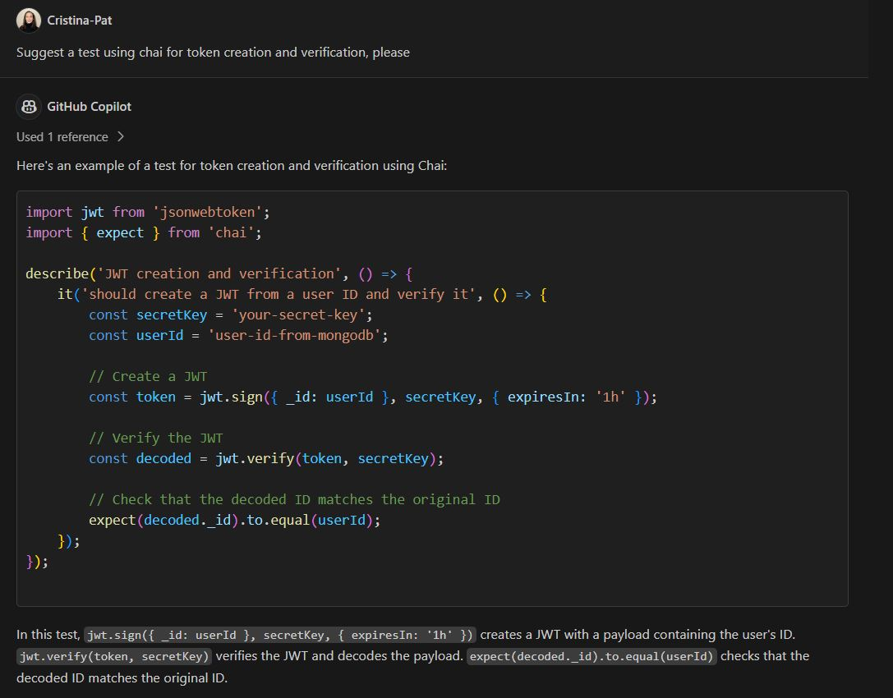
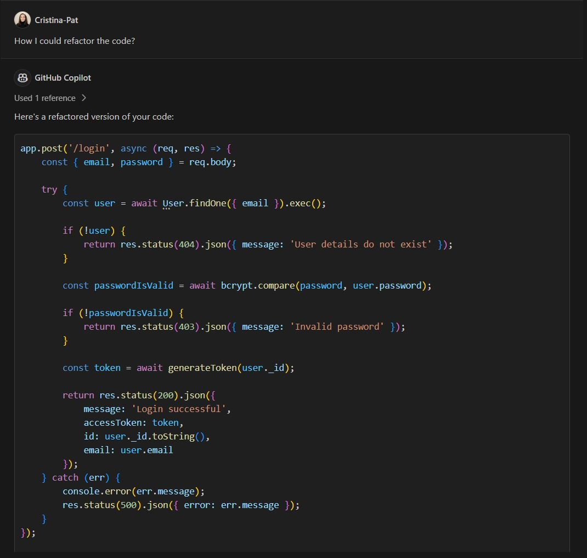
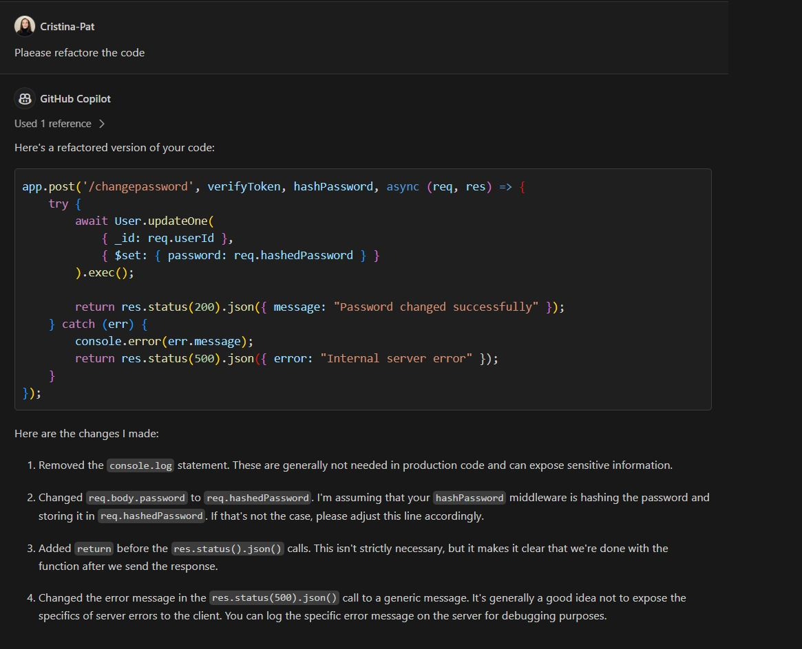

## Using Generative AI for JSON Web Token Authentication, Testing and Refactoring

Figure 1: GitHub Copilot - generate JWT token

Figure 2: GitHub Copilot - verify JWT

Figure 3: GitHub Copilot - test JWT creation and validation

Figure 4: GitHub Copilot - login edge cases

Figure 5: GitHub Copilot - refactor the login endpoint

Figure 6: GitHub Copilot - refactor chancepasspoword endpoint

