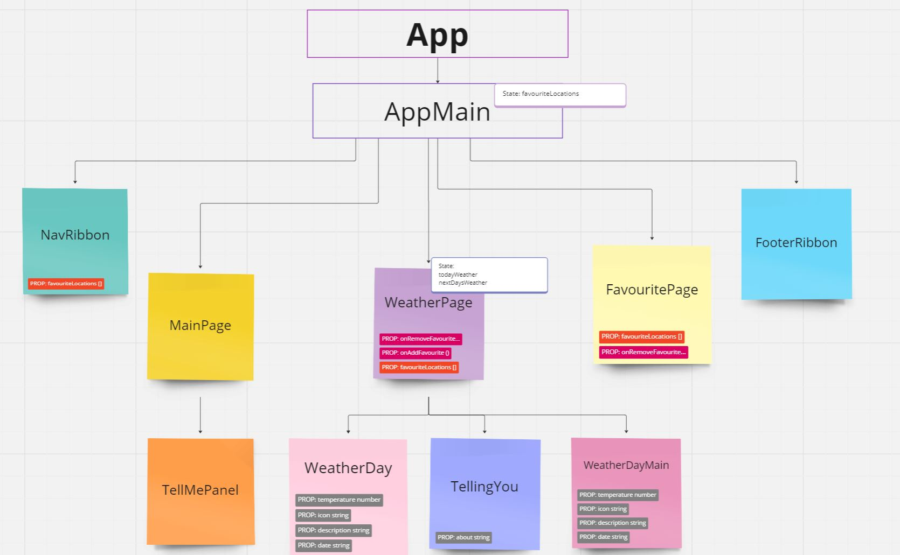
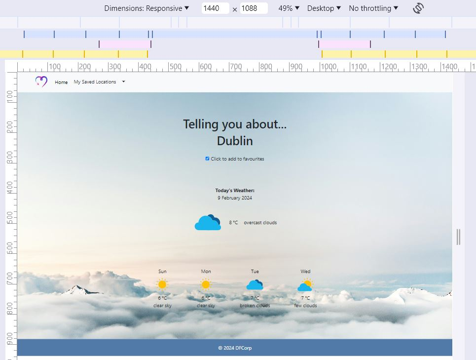
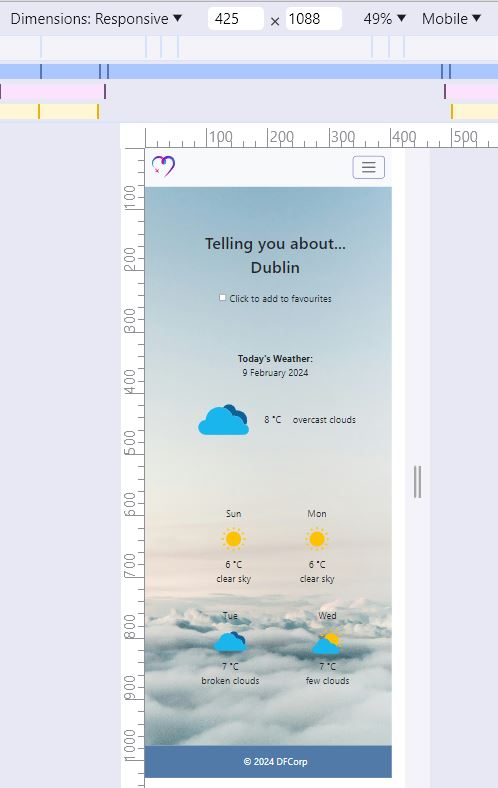

# User Stories and Tests

## Core features

### User Story 1
As a travel app user, I want to see a search box on the homepage so I can easily search for any town or city by name.

### User Story 2
As the travel application's UI layer, I need to trigger the Business Layer to send a request to a weather API in order to obtain a 5-day forecast for a specified location, ensuring that the location is valid and can be found.

### User Story 3
As a user of the travel app, I want to search for a town or city by name so that I can view relevant weather information and expect the app to display a 5-day weather forecast for the selected location.

### User Story 4
As a user of the travel app, I want to be able to save my favorite locations for quick access.

### Component hierarchy

Figure 1: Component Hierarchy and Data Flow - Travel Info App

[Miro Component Hierarchy for Travel Info App](https://miro.com/app/board/uXjVNoOdxRc=/)

AppMain serves as the parent component. Because multiple child components must know the favourite locations (NavRibbon, WeatherPage, FavouritesPage), it manages the favouriteLocations state and provides to child components functions such as addFavouriteLocation and removeFavouriteLocation to modify this state.

WeatherPage, a child component of AppMain, includes state related to the weather in the selected location (todayWeather and nextDaysWeather) and functions (handleCheckboxChange and getData). handleCheckboxChange is a function responsible for updating the favouriteLocations state in AppMain based on whether the checkbox is checked or not. getData is a function tasked with fetching weather data and updating the todayWeather and nextDaysWeather state within WeatherPage.

WeatherPage incorporates the TellingYou, WeatherDayMain and WeatherDay components. TellingYou displays information about the selected location.

Additionally, WeatherPage passes down the weather forecast information to its child components. WeatherDayMain displays the weather forecast for the current day using the props received from WeatherPage, while WeatherDay displays the weather forecast for the next days and is rendered multiple times based on the forecast data.
 
NavRibbon and FavouritesPage, also child components of AppMain, receive the favouriteLocations prop from their parent. Since this information is passed down from the parent component and isn't expected to change frequently, it's likely not considered state.

This approach emphasizes the distinction between state, which represents data managed within a component and likely changes over time, and props, which are passed down from parent components and often remain unchanged within the component. Additionally, this approach presents the flow of data from parent to child components, highlighting how components interact with each other within the application

### Tests
App test suite:    

    1. it updates the navigation when favourites change.
    2. it updates the navigation when location is removed from favourites page.

Navigation test suite:

    1. it should render Home link.
    2. it should not render 'My Saved Locations' if there are not saved locations.
    3. it should render 'My Saved Locations' if there are saved locations.
    4. it should render links to the saved locations.

FavouritesPage test suite:

    1. it shows the favourites list.
    2. it calls onRemoveFavourite callback when clicking on an favourite image and passes the correct location.

WeatherPage test suits: 

    1. it should call a function when add to favourites is selected.
    2. it should pass the location to the callback function when add to favourites is selected. 
    3.it should show the favourite checkbox as checked when the location is favourite
    4. it should call a function when add to favourites is deselected.
    5. it should pass the location to the callback function when add to favourites is deselected.

TellingYou test suite:

    1. it should render a title saying 'Telling you about...'.
    2. it should render the about property.

Today weather day (WeatherDayMain) shows:

    1. temperature
    2. day
    3. description

Next weather days (WeatherDay) show:

    1. temperature
    2. day
    3. description

## Acceptance Criteria 

Figure 2: Desktop viewport - Travel Info App

Figure 3: Mobile viewport - Travel Info App